# 🔍 Coletando Informações de PDU - Identificar Endereços MAC e IP

---

## 📌 Sobre o Laboratório

Neste laboratório da **Série: Laboratórios Cisco NetAcad**, exploramos a inspeção de quadros Ethernet (Camada 2) e pacotes IP (Camada 3) à medida que trafegam de uma origem até um destino local ou remoto. 

O objetivo é compreender como os endereços **MAC** e **IP** se comportam ao longo da jornada dos dados, identificando alterações de cabeçalhos nos saltos de rede e analisando o papel do gateway padrão (*Default Gateway*).

---

## 👨‍💻 Sobre o Autor

**Jordão Paulo**

*Analista de Cibersegurança | Analista de Redes | Infraestrutura de TI*

*Founder & CEO na Mpeko ICT Solutions e NerdNest*

Como criador da série **Laboratórios Cisco NetAcad**, estruturei este projeto para unir rigor técnico, arquitetura perimetral e aplicação prática no mundo real, eliminando o abismo entre a teoria dos livros e o ambiente de produção — tudo simulado no **Cisco Packet Tracer**.

---

## 🎯 Objetivos do Laboratório

* **Parte 1:** Coletar informações de PDU para comunicação em uma rede local (LAN).
* **Parte 2:** Coletar informações de PDU para comunicação em redes remotas (WAN/Inter-rede).
* **Análise Teórica:** Responder às questões de reflexão sobre o modelo OSI, comportamento do Access Point e roteamento de pacotes.

---

## 📥 Downloads e Recursos

| Recurso | Ação |
| :--- | :--- |
| **Arquivo do Lab (.pka)** | [](https://raw.githubusercontent.com/unknown-code7/identify-mac-and-ip-addresses/main/Identify%20MAC%20and%20IP%20Addresses.pka) |
| **Vídeo Explicativo** | [](https://www.facebook.com/share/v/1HrREZbA4B/) |

---

## 🏗️ Topologia da Rede (Mermaid Diagram)

```mermaid
graph TD
    subgraph Subnet_10 ["🌐 Rede Remota (10.10.10.0/24)"]
        AP["📡 Access Point"]
        HostA["💻 Laptop (10.10.10.2)"]
        HostB["💻 Laptop (10.10.10.3)"]
        Switch1["🔀 Switch 1"]
        
        HostA -.-|Wireless| AP
        HostB -.-|Wireless| AP
        AP --- Switch1
    end

    subgraph Router_Core ["🛡️ Roteamento de Borda"]
        Router["🌐 Router"]
    end

    subgraph Subnet_172 ["🏠 Rede Local (172.16.31.0/24)"]
        Switch2["🔀 Switch 2"]
        PC1["🖥️ PC (172.16.31.2)"]
        PC2["🖥️ PC (172.16.31.3)"]
        
        Switch2 --- PC1
        Switch2 --- PC2
    end

    Switch1 --- Router
    Router --- Switch2

    style Router fill:#003366,stroke:#0066cc,stroke-width:2px,color:#fff
    style AP fill:#006622,stroke:#009933,stroke-width:2px,color:#fff
    style Subnet_10 fill:#1a1a1a,stroke:#444,stroke-width:1px
    style Subnet_172 fill:#1a1a1a,stroke:#444,stroke-width:1px

```



---

## 📝 Instruções e Roteiro de Execução

### Parte 1: Comunicação em Rede Local

1. Clique no host **172.16.31.3** e abra o **Command Prompt**.
2. Execute o comando:
```bash
ping 172.16.31.2

```


3. Mude para o modo **Simulation**, repita o comando e inspecione a PDU na guia **Outbound PDU Details**:
* **At Device:** `172.16.31.3`
* **Source MAC Address:** `0060.7036.2849`
* **Destination MAC Address:** `000C.85CC.1DA7`
* **Source IP Address:** `172.16.31.3`
* **Destination IP Address:** `172.16.31.2`


4. Use o botão **Capture / Forward** para acompanhar a movimentação do pacote até o destino final e preencha a tabela de rastreamento.

---

### Parte 2: Comunicação em Rede Remota

1. Retorne ao **Command Prompt** do host **172.16.31.3**.
2. Execute o comando direcionado à rede remota:
```bash
ping 10.10.10.2

```


3. Mude para o modo **Simulation** e acompanhe o pacote até o destino.
4. Observe os dados na PDU e identifique o destino da Camada 2:
* **Source MAC Address:** `0060.7036.2849`
* **Destination MAC Address:** `00D0.BA8E.741A` *(MAC da interface FastEthernet0/0 do Roteador / Gateway Padrão)*
* **Source IP Address:** `172.16.31.3`
* **Destination IP Address:** `10.10.10.2`


---

## ❓ Questões de Reflexão & Respostas Técnicas

1. **Que tipos diferentes de cabos/meios foram usados para conectar os dispositivos?**
*R: Foram utilizados cabos de cobre de par trançado (Straight-Through/Direto), cabos seriais (para links WAN) e meio sem fio (radiofrequência/Wi-Fi).*
2. **Os cabos alteraram o tratamento da PDU de alguma forma?**
*R: Não. Os cabos operam na Camada 1 (Física) e apenas codificam e transmitem os bits brutos, sem interferir nos cabeçalhos lógicos ou físicos.*
3. **O Access Point sem fio fez algo com as PDUs que recebeu?**
*R: Sim. Ele realizou a conversão do formato de quadro sem fio (IEEE 802.11) para o formato Ethernet de rede cabeada (IEEE 802.3).*
4. **O endereçamento da PDU foi alterado pelo Access Point?**
*R: Não. O Access Point é um dispositivo de Camada 2 que apenas reencaminha os quadros sem alterar os endereços MAC ou IP de origem e destino.*
5. **Qual foi a camada OSI mais alta que o Access Point utilizou?**
*R: Camada 2 (Enlace de Dados).*
6. **Em que camada do Modelo OSI operam os cabos e os Access Points?**
*R: Os cabos operam na Camada 1 (Física). Os Access Points operam nas Camadas 1 e 2 (Física e Enlace de Dados).*
7. **Ao examinar a guia PDU Details, qual endereço MAC apareceu primeiro: o de origem ou o de destino?**
*R: O endereço MAC de Destino (Destination MAC).*
8. **Às vezes as PDUs eram marcadas com X vermelho, enquanto outras tinham marcadores verdes. Qual é o significado dessas marcações?**
*R: O símbolo verde indica que o dispositivo processou ou aceitou a PDU com sucesso. O X vermelho indica que o pacote foi descartado (por exemplo, quando um switch descarta um frame em uma porta errada ou quando há divergência no destino).*
9. **Sempre que a PDU era enviada entre a rede 10 e a rede 172, havia um ponto em que os endereços MAC mudavam repentinamente. Onde isso ocorreu?**
*R: No Roteador (Router). Ao rotear pacotes entre sub-redes diferentes, o roteador remove o quadro da camada 2 anterior e reconstrói um novo quadro com o seu MAC de saída como origem e o MAC do próximo salto/destino como destino.*
10. **Qual dispositivo usa os endereços MAC que começam com 00D0:BA?**
*R: As interfaces de rede do Roteador.*
11. **A quais dispositivos pertenciam os outros endereços MAC?**
*R: Pertenciam às placas de rede (NICs) dos computadores (PCs e Laptops) e dos Switches.*
12. **Os endereços IPv4 de envio e recebimento mudaram em alguma das PDUs?**
*R: Não. Como este cenário utiliza roteamento IPv4 simples (sem NAT), os IPs de origem e destino permanecem inalterados do início ao fim da transmissão.*
13. **Quando você segue a resposta de um ping (pong), o que acontece com os endereços de origem e destino?**
*R: Os endereços são invertidos. O endereço de origem do pacote enviado torna-se o endereço de destino na resposta, e vice-versa.*
14. **Por que você acha que as interfaces do roteador fazem parte de duas redes IP diferentes?**
*R: Porque a função fundamental de um roteador é interconectar redes IP distintas, servindo como a ponte (gateway) de comunicação entre diferentes domínios de broadcast.*
15. **Quais redes IP estão conectadas pelo roteador?**
*R: A rede `172.16.31.0/24` e a rede `10.10.10.0/24`.*

---

### 📜 Direitos e Licenciamento

© 2026 **Jordão Paulo**. Todos os direitos reservados.

*Conteúdo desenvolvido para fins educacionais e de capacitação técnica em Redes de Computadores e Cibersegurança utilizando o Cisco Packet Tracer.*

